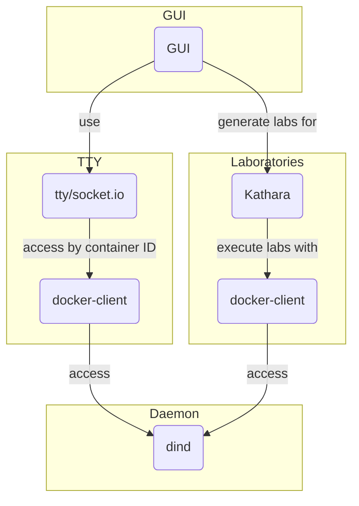

# KaaS - Katharà as a Service

With this project, we start to implement a containerized interface for Kathará, which will be able to execute and manage laboratories via your web browser.

## Goals of the project
- Creation of a web-interface, where you can drag-and-drop nodes and connections,
- Mapping from the UI laboratory configuration to Katharà's `lab.conf` notation.
- Execution of the laboratory with Kathará via Docker-in-Docker `dind`.
- Enable shell access to nodes of a laboratory via http.

## Initialization

After you have installed [Docker](https://www.docker.com/) you can use `source kaas_aliases.sh` in every new terminal to generate shortcuts to run the KaaS stack.
Internally, a loadbalancer - [Traefik](https://traefik.io/traefik/) - resolves the names for our service, which are currently available under the domain `.test`.
To be able to access the services, you must point the domain name entries `kaas.test`, `rest.kaas.test`, `tty.kaas.test`, and `traefik.kaas.test` to `localhost`.
You may do so by adding the corresponding line to `/etc/hosts`, or just call our script `./kaas_dns.sh hosts` only once.

### Short Initialization Overview
- `source kaas_aliases.sh`, to get aliases for `docker compose`
- `./kaas_dns.sh hosts`, to add DNS entries to `/etc/hosts`.

### Deployment

If you just want to try the stack, use `kaas up -d` to download precompiled images and start the stack. 

### Development

For development purposes, you can call the stack with `kaas.dev up -d`, but a few dependencies need to be installed on your host machine:
- Go to the folder `kathara-ui-vue3` and install the npm dependencies by calling `npm install`
- Go to the folder `kathara-rest`, create a `virtualenv` for Python3 and install the dependencies with `pip install -r requirements-dev.txt`.

You can build new images by calling `kaas.dev build`, if you want to test your changes.

## System Access
After the system has been successfully initialize you can access the components with the following links:

- [User Interface](http://kaas.test)
- [REST Interface](http://rest.kaas.test/docs)
- [TTY Interface](http://tty.kaas.test)
- [Traefik](http://traefik.kaas.test)

## Related resources - to be evaluated
- Just as reference: [Netkit Lab Generator](https://github.com/KatharaFramework/Netkit-Lab-Generator)
- [Mininet Editor](https://github.com/Thomaash/me)
- [Kathara in Docker](https://github.com/KatharaFramework/Kathara/issues/167)
- [TTY for container](https://github.com/wrfly/container-web-tty)
- [TTY.js](https://github.com/chjj/tty.js)
- [Netkit creator](https://github.com/agp8x/netkit-creator)

## Publication and Presentation
The P4 Multipath transmissions concept is developed by [Computer Networks Group](https://www.uni-bamberg.de/ktr/). 

Our publication can be found here:
- <a href="https://opus.bibliothek.uni-wuerzburg.de/files/32218/Grossmann_Le_Kathara_WueWoWas23_1570913204.pdf" target="_blank"> **Visualization of Network Emulation Enabled by Kathará**</a> (at WueWoWas 2023)
- <a href="https://lsinfo3.github.io/WueWoWAS2023/assets/slides/marcel_grossmann.pdf" target="_blank">Presentation</a>
