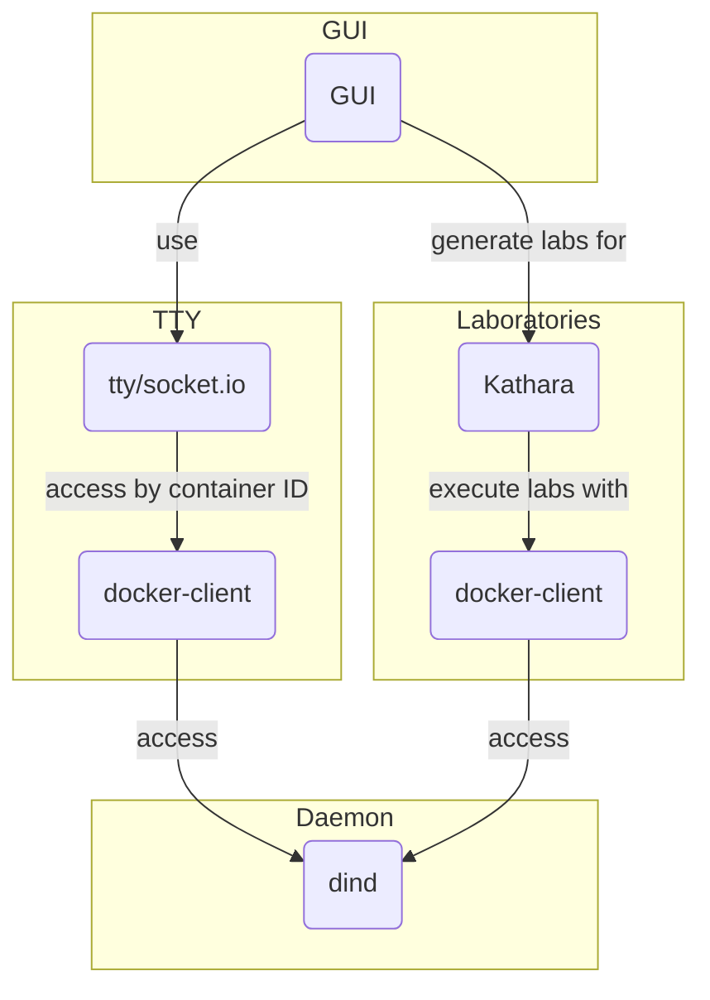

# Kathara-UI

With this project, we start to implement a containerized UI for Kathará, which will be able to execute and manage laboratories via your web browser.

## Goals of the project
- Creation of a web-interface, where you can drag-and-drop nodes and connections,
- Mapping from the UI laboratory configuration to Katharà's `lab.conf` notation.
- Execution of the laboratory with Kathará via Docker-in-Docker `dind`.
- Enable shell access to nodes of a laboratory via http.

## Structure

### Kathará in Docker (kind)
- With the Dockerfile in kind, you can build the base image for the project.

## Related resources - to be evaluated
- Just as reference: [Netkit Lab Generator](https://github.com/KatharaFramework/Netkit-Lab-Generator)
- [Mininet Editor](https://github.com/Thomaash/me)
- [Kathara in Docker](https://github.com/KatharaFramework/Kathara/issues/167)
- [TTY for container](https://github.com/wrfly/container-web-tty)
- [TTY.js](https://github.com/chjj/tty.js)
- [Netkit creator (Clemens)](https://github.com/agp8x/netkit-creator)
