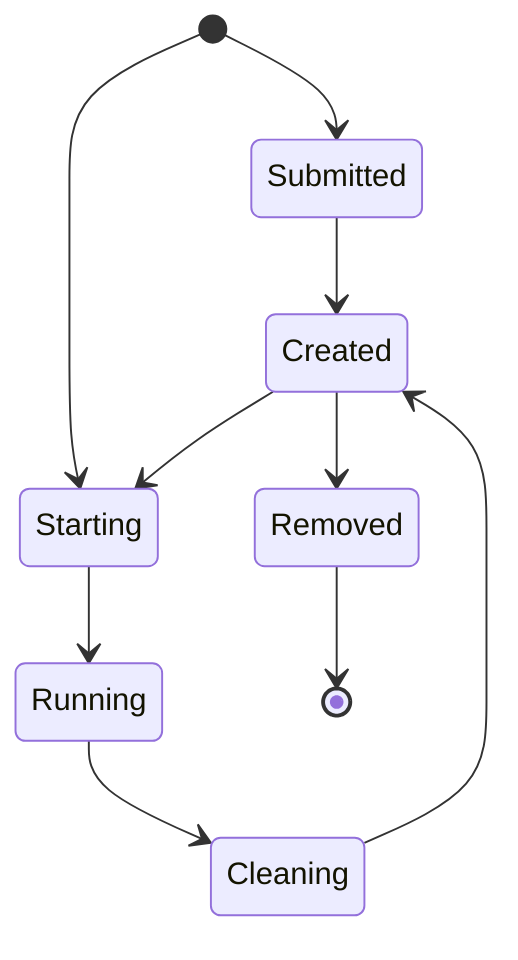

# Kathara REST API

## Installation 

### Virtualenv

```bash
python3 -m venv venv
source venv/bin/activate
pip3 install -r requirements.txt
```

### Running the server
```bash
uvicorn rest:app --reload
```

## JSON Object Validation

### Laboratory Configuration
JSON files, which contain a laboratory configuration will be validated by a [schema](res/schemas/laboratory.json)

### Messages
JSON messages sent and received by the server are validated against this [schema](res/schemas/message.json)

## Sending Objects

### For Creating the  Laboratory

For testing purposes an example [lab.json](lab.json) can be sent to the REST API, which will create the laboratory `test`
```bash
curl -X POST -H "Content-Type: application/json" -d @lab.json http://localhost:8000/lcreate
```

If you have `jq` installed you can directly save the returned lab_hash:
```bash
LAB_HASH=$(curl -X POST -H "Content-Type: application/json" -d @lab.json http://localhost:8000/lcreate | jq '.lab_hash')
```

### For Starting the  Laboratory

```bash
curl -X POST -H "Content-Type: application/json" -d "{\"lab_name\": \"example\"}"  http://localhost:8000/lstart
```
If you have `jq` installed you can directly save the returned lab_hash:

```bash
LAB_HASH=$(curl -X POST -H "Content-Type: application/json" -d "{\"lab_name\": \"example\"}"  http://localhost:8000/lstart | jq '.lab_hash')
```

Returns the hash value of the laboratory, referenced as `$LAB_HASH` in the following commands.

### For Cleaning the  Laboratory

```bash
curl -X POST -H "Content-Type: application/json" -d "{\"lab_name\": \"example\", \"lab_hash\": $LAB_HASH}"  http://localhost:8000/lclean
```

### Listing Objects in the Laboratory
```bash
curl -X POST -H "Content-Type: application/json" -d "{\"lab_name\": \"example\", \"lab_hash\": $LAB_HASH}"  http://localhost:8000/linfo
```

### Wiping everything
```bash
curl -X POST -H "Content-Type: application/json" -d "{\"lab_name\": \"example\", \"lab_hash\": $LAB_HASH}"  http://localhost:8000/wipe
```

### Laboratory States
SUBMITTED = 1
CREATED = 2
STARTING = 3
RUNNING = 4
CLEANING = 5
REMOVED = 6

